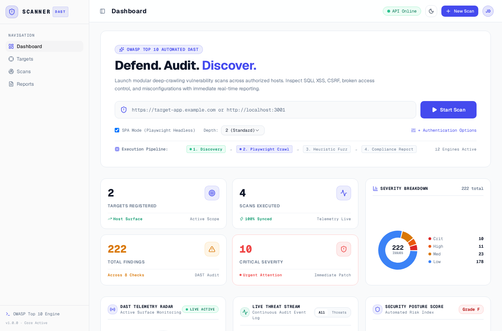
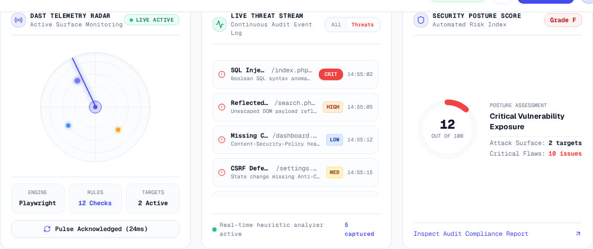
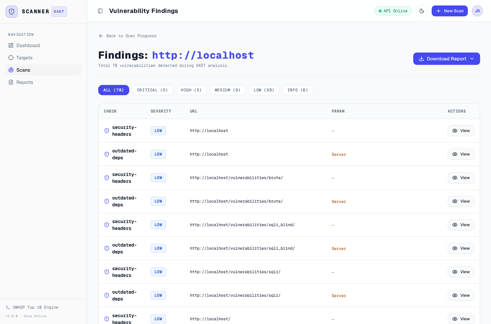
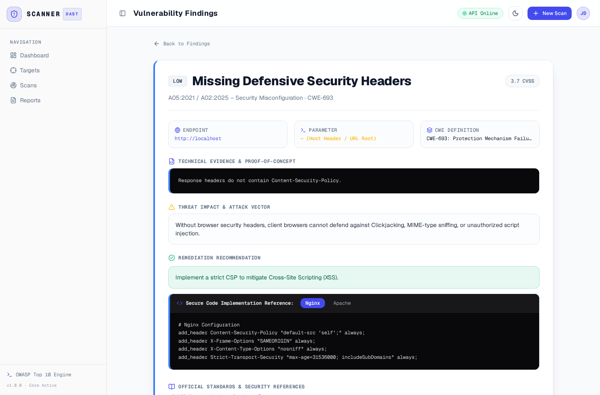
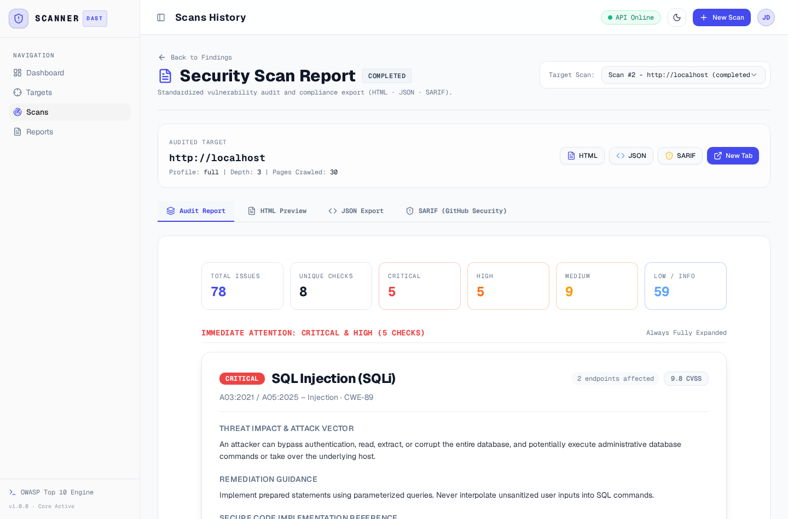
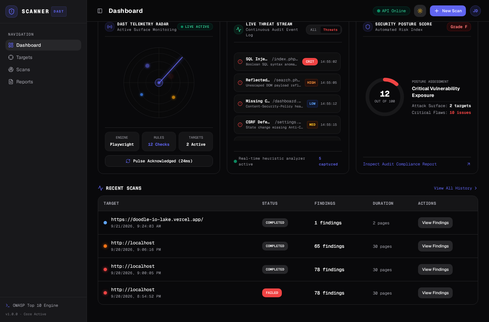

# VulnScan: Automated OWASP Top 10 DAST Platform

VulnScan is an automated Dynamic Application Security Testing (DAST) platform designed to audit web applications and APIs for security defects. It combines a Playwright-driven headless crawler with modular heuristic analyzers to detect injection flaws, authentication bypasses, cross-site scripting, missing defenses, and software supply chain vulnerabilities in modern single-page applications (SPAs) and traditional multi-page web architectures.

---

## Architecture Overview

The system is separated into three core domains:

```
+-----------------------------------------------------------------------+
|                            USER INTERFACE                             |
|    React 19  |  Vite  |  Tailwind CSS  |  shadcn/ui  |  Recharts       |
|    - Command Center Dashboard with Real-Time SOC Telemetry Widgets   |
|    - Severity Breakdown Analytics & Execution Pipeline Visualizer     |
|    - Interactive Audit Report Viewer (HTML, JSON, SARIF)              |
+-----------------------------------+-----------------------------------+
                                    | REST API (HTTP / JSON)
+-----------------------------------v-----------------------------------+
|                           BACKEND SERVICE                             |
|    FastAPI  |  SQLAlchemy  |  Pydantic  |  Alembic                    |
|    - REST API Endpoints: /api/targets, /api/scans, /api/findings      |
|    - Asynchronous Task Scheduling & Background Job Management         |
|    - Compliance Report Generators (HTML, JSON, SARIF v2.1.0)          |
+-----------------------------------+-----------------------------------+
                                    | Internal Engine Invocation
+-----------------------------------v-----------------------------------+
|                           SECURITY ENGINE                             |
|    Playwright Headless  |  HTTPX Async Engine  |  Scope Validator     |
|    - Hybrid Crawler: DOM Event Traversal + Static Link Discovery      |
|    - Session & Authentication State Manager (Bearer, Cookie, Form)    |
|    - Modular Heuristic Checks:                                        |
|      * SQL Injection (SQLi)           * Insecure Cookies              |
|      * Reflected XSS (DOM / Input)    * Open Redirect                 |
|      * Cross-Site Request Forgery     * Path Traversal                |
|      * Defensive Security Headers     * Command Injection             |
|      * Sensitive File Exposure        * Outdated Software Components  |
+-----------------------------------------------------------------------+
```

---

## Directory Structure

```
vulnscan/
├── backend/
│   ├── alembic/              # Database migration configurations
│   ├── app/
│   │   ├── api/              # FastAPI route controllers (targets, scans, findings, reports)
│   │   ├── checks/           # Modular OWASP Top 10 DAST vulnerability check plugins
│   │   ├── cli/              # Terminal CLI commands and subroutines
│   │   ├── core/             # Headless crawler, engine orchestrator, scope validator
│   │   ├── models/           # SQLAlchemy database entities (Target, Scan, Finding)
│   │   ├── reports/          # Report formatters: HTML (accordion grouped), JSON, SARIF
│   │   ├── schemas/          # Pydantic request and response contracts
│   │   ├── config.py         # Application settings and environment configuration
│   │   ├── database.py       # Database session factory and engine connection
│   │   └── main.py           # FastAPI application entrypoint
│   ├── tests/                # Comprehensive test suite covering checks, crawler, and API
│   └── requirements.txt      # Python runtime dependencies
├── frontend/
│   ├── src/
│   │   ├── api/              # Axios HTTP client endpoints
│   │   ├── components/       # shadcn/ui primitives (Button, Badge, Table, Modal, Navbar, Sidebar)
│   │   ├── context/          # ThemeProvider (Light and Dark mode toggle with localStorage)
│   │   └── features/
│   │       ├── dashboard/    # Command Center, Stat cards, Donut chart, Telemetry widgets
│   │       │   └── widgets/  # LiveRadarScanner, LiveSecurityEventStream, SecurityPostureGauge
│   │       ├── findings/     # Vulnerability findings matrix and advisory detail viewer
│   │       ├── reports/      # Integrated multi-format report viewer
│   │       ├── scans/        # Scan creation, active execution progress, history table
│   │       └── targets/      # Target inventory management
│   ├── package.json          # Node.js dependencies and build scripts
│   └── vite.config.js        # Vite bundler configuration
├── docs/
│   └── screenshots/          # Application layout and interface documentation assets
├── vulnscan.py               # Standalone CLI entrypoint for terminal-driven audits
└── pytest.ini                # Pytest configuration file
```

---

## Tools and Technologies

- **Frontend**: React 19, Vite, Tailwind CSS, shadcn/ui, Radix UI primitives, Recharts, Lucide Icons.
- **Backend**: Python 3.12+, FastAPI, Uvicorn, SQLAlchemy ORM, Pydantic v2, Alembic.
- **Engine**: Playwright (Chromium headless DOM crawl), HTTPX (asynchronous concurrent HTTP requests), Beautiful Soup 4.
- **Standards & Compliance**: OWASP Top 10 (2021/2025), CWE (Common Weakness Enumeration), CVSS v3.1, SARIF v2.1.0 (Static Analysis Results Interchange Format for GitHub Advanced Security).

---

## Application Layout and Interfaces

### Dashboard and Command Center
The central command console provides immediate access to scan initiation, telemetry statistics, severity distribution, and real-time security widgets.



### Real-Time SOC Telemetry Widgets
Live operational widgets monitor attack surface health, stream audit events continuously, and evaluate security posture risk.



### Findings Table
Aggregated table of all discovered vulnerabilities with filtering by severity, check type, and affected endpoints.



### Technical Advisory Detail
Standardized vulnerability advisories detailing severity, CVSS scores, OWASP/CWE mappings, exact Proof-of-Concept evidence, threat vectors, and framework-specific remediation code.



### Compliance Report Viewer
Multi-format report viewer with export capabilities to HTML, JSON, and SARIF formats.



### Theme Switching Support
Full support for both high-contrast White Light Theme and low-light Dark Mode.



---

## Developer and Operator Guide

### 1. Launching Scans

Scans can be triggered through two methods:
- **Quick Scan (Dashboard)**: Enter a target URL in the Command Center input box and click **Start Scan**. Default parameters are applied (standard depth, SPA enabled).
- **Custom Scan Configuration (`/scans/new`)**: Click **+ New Scan** to open full parameter customization.

### 2. Configuration Options Explained

#### Target URL
- Defines the target root or entrypoint (e.g., `https://staging.example.com` or `http://localhost:3000`).
- The scope validator enforces strict host boundaries. Requests traversing external domains are blocked to prevent out-of-scope fuzzing.

#### Scan Profile
- **Full Scan**: Executes all 12 active OWASP security checks across discovered endpoints.
- **Quick Scan**: Executes lightweight non-intrusive checks (Security Headers, Insecure Cookies, Sensitive Files) for rapid surface assessments.
- **Custom Profile**: Enables granular selection of specific check modules (e.g., test only for SQL Injection and CSRF).

#### Target Tech Stack
- **Auto-detect (Recommended)**: Analyzes HTTP response headers, meta tags, and cookies to identify backend technologies (PHP, Node.js, Python, Java, WordPress).
- **Manual Selection**: Tunes payload sets specifically for the designated technology stack, reducing superfluous payloads.

#### SPA Mode (Playwright Headless)
- **Enabled**: Launches a headless Chromium browser instance to execute JavaScript, navigate client-side routers (React Router, Vue Router), and trigger dynamic DOM events. Recommended for modern single-page applications.
- **Disabled**: Uses standard asynchronous HTTP requests. Fast and low-overhead; ideal for server-rendered HTML applications or REST APIs.

#### Crawl Depth
- **Depth 1 (Surface)**: Analyzes only the root URL and immediate form inputs.
- **Depth 2 (Standard)**: Crawls internal links up to two hops from the entrypoint. Suitable for most security evaluations.
- **Depth 3 (Deep)**: Traverses multi-level navigational hierarchies and paginated listings.

#### Authentication Modes
- **None**: Scans publicly exposed surfaces without authentication headers.
- **Cookie**: Supplies custom session cookies (e.g., `sessionid=abc123; role=admin`) injected into every crawler and check request.
- **Bearer Token**: Supplies an Authorization header token (e.g., `eyJhbGci...`) for API token authentication.
- **Login Form**: Provides a login URL, username, and password. Playwright locates login fields, inputs credentials, and persists session cookies across the scan.

#### Rate Limiting
- Configures client concurrency and request throttling (e.g., 5 requests/sec) to avoid overloading target servers or triggering defensive rate limiters.

### 3. Real-Time SOC Telemetry Widgets

- **DAST Telemetry Radar**: Visualizes active crawling sweeps across perimeter hosts. The **Ping Attack Surface** button measures live target roundtrip response latency.
- **Live Threat Stream**: Displays an event log of heuristic signals captured during fuzzing. Use the **Threats** filter to isolate critical alerts from standard crawler path discoveries.
- **Security Posture Score**: Computes a dynamic risk score (0 to 100) and letter grade based on vulnerability severity weights (-12 for Critical, -5 for High/Medium).
- **Execution Pipeline**: Tracks the 4 sequential audit stages:
  1. *Discovery*: Target reachability, scope validation, and technology fingerprinting.
  2. *Playwright Crawl*: Dynamic DOM exploration and input parameter extraction.
  3. *Heuristic Fuzz*: Concurrent payload injection and anomaly verification.
  4. *Compliance Report*: Findings correlation, severity scoring, and export compilation.

### 4. Analyzing Findings and Advisories

Every detected vulnerability includes structured audit fields:
- **Title and Header**: Check identifier with CVSS score and OWASP Top 10 category.
- **Target Context**: Affected endpoint URL and injected parameter name.
- **Technical Evidence & Proof-of-Concept**: Raw HTTP request/response fragments, matched database error strings, or reflected payloads demonstrating exploitability.
- **Threat Vector**: Operational impact analysis explaining potential business or security risks.
- **Remediation Recommendation**: Specific corrective actions.
- **Secure Code Implementation Reference**: Tabbed reference code snippets (e.g., Nginx, Apache, Node.js, Python) illustrating secure configurations.

### 5. Report Formats and Compliance Exports

Reports can be reviewed via the integrated **Report Viewer** or exported directly:
- **HTML Report**: Executive and technical summary document. Critical and High severity issues remain expanded by default, while Medium, Low, and Informational findings are organized into collapsible accordions.
- **JSON Export**: Structured schema of all scan metadata, target metrics, and raw finding objects for custom automation or SIEM ingestion.
- **SARIF Export (v2.1.0)**: Standard format supported by GitHub Advanced Security Code Scanning, GitLab Security Dashboards, and Microsoft Defender.

---

## Headless CLI Operations

Headless security assessments can be executed directly from the terminal using `vulnscan.py`:

```bash
# Validate target scope
python vulnscan.py check-scope --allowed localhost --target http://localhost/index.php

# Perform crawler discovery
python vulnscan.py crawl --target http://localhost/index.php

# Execute a full audit against a target
python vulnscan.py scan --target http://localhost/index.php

# Generate a compliance report
python vulnscan.py report --scan-id 1 --format html --output report.html
```

---

## Git and Deployment Standards

When preparing this project for production deployment or version control:
- The `.gitignore` file enforces exclusion of sensitive credentials (`.env`), Python virtual environments (`venv/`), Node dependencies (`node_modules/`), local databases (`*.db`), and test report artifacts.
- Never commit private API keys, authorization tokens, or session fixtures to version control.
- Configuration variables must be managed through environment variables or deployment secret stores.
