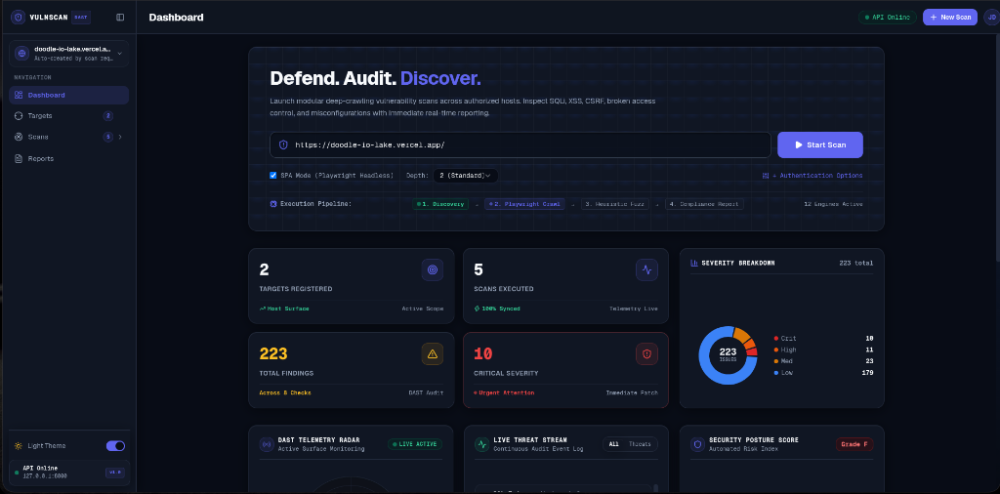

# VulnPulse: Autonomous Web Vulnerability & Attack Surface Security Engine

VulnPulse is a standalone Dynamic Application Security Testing (DAST) platform designed to audit web applications and APIs for security defects. It pairs a Playwright-driven headless browser crawler with concurrent heuristic fuzzing engines to uncover injection flaws, authorization bypasses, cross-site scripting, defensive header omissions, and vulnerable dependencies across modern Single Page Applications (SPAs) and traditional multi-page architectures.




---

## Architecture Overview

The system is organized into three decoupled layers:

```
+-----------------------------------------------------------------------+
|                            USER INTERFACE                             |
|    React 19  |  Vite  |  Tailwind CSS  |  shadcn/ui  |  Recharts       |
|    - Command Center Dashboard with Real-Time SOC Telemetry Widgets   |
|    - Severity Breakdown Analytics & Execution Pipeline Visualizer     |
|    - Interactive Audit Report Viewer (HTML, JSON, SARIF)              |
+-----------------------------------+-----------------------------------+
                                    | REST API (HTTP / JSON)
+-----------------------------------v-----------------------------------+
|                           BACKEND SERVICE                             |
|    FastAPI  |  SQLAlchemy  |  Pydantic  |  Alembic                    |
|    - REST API Endpoints: /api/targets, /api/scans, /api/findings      |
|    - Asynchronous Task Scheduling & Background Job Management         |
|    - Compliance Report Generators (HTML, JSON, SARIF v2.1.0)          |
+-----------------------------------+-----------------------------------+
                                    | Internal Engine Invocation
+-----------------------------------v-----------------------------------+
|                           SECURITY ENGINE                             |
|    Playwright Headless  |  HTTPX Async Engine  |  Scope Validator     |
|    - Hybrid Crawler: DOM Event Traversal + Static Link Discovery      |
|    - Session & Authentication State Manager (Bearer, Cookie, Form)    |
|    - Modular Heuristic Checks:                                        |
|      * SQL Injection (SQLi)           * Insecure Cookies              |
|      * Reflected XSS (DOM / Input)    * Open Redirect                 |
|      * Cross-Site Request Forgery     * Path Traversal                |
|      * Defensive Security Headers     * Command Injection             |
|      * Sensitive File Exposure        * Outdated Software Components  |
+-----------------------------------------------------------------------+
```

## Directory Structure

```
vulnscan/
├── backend/
│   ├── app/
│   │   ├── api/              # FastAPI endpoints (targets, scans, findings, reports)
│   │   ├── checks/           # Vulnerability analyzers (SQLi, XSS, CSRF, headers, traversal, etc.)
│   │   ├── core/             # Playwright crawler, engine orchestrator, scope validator
│   │   ├── models/           # SQLAlchemy database entities (Target, Scan, Finding)
│   │   └── reports/          # Report generators (HTML with accordions, JSON, SARIF v2.1.0)
│   └── tests/                # Engine and check test suites (Pytest + HTTPX test client)
├── frontend/
│   └── src/
│       ├── components/       # shadcn/ui primitives, theme toggle, layout shells
│       └── features/         # Dashboard, widgets, findings matrix, reports, scans, targets
├── vulnscan.py               # Standalone CLI runner for headless terminal audits
├── dashboard.png             # Command center dashboard layout
└── telemetry.png             # Real-time telemetry widgets layout
```

---

## Developer & Usage Guide

### Target Scope & Ingestion
Provide a target entrypoint URL (e.g., `https://staging.app.example.com` or `http://localhost:3000`). The scope validator enforces strict host boundaries; external link traversals and third-party origins are blocked from active payload fuzzing.

### Scan Configuration Options
- **Scan Profile**:
  - *Full Scan*: Dispatches all checks across crawled routes (SQLi, XSS, CSRF, Path Traversal, Command Injection, Open Redirect, Sensitive Files, Headers, Insecure Cookies, Outdated Deps).
  - *Quick Scan*: Executes non-intrusive surface checks (Headers, Cookies, Sensitive Exposed Files).
  - *Custom*: Allows granular toggle of individual check engines.
- **SPA Mode (Playwright Headless)**: Activates a headless Chromium instance to execute JavaScript, traverse client-side routes (React, Vue, Angular), and trigger event listeners. Disable for static HTML or headless REST APIs.
- **Crawl Depth**: Level 1 (Surface URL and forms), Level 2 (Standard 2-hop navigation links), Level 3 (Deep link and hierarchy traversal).
- **Authentication**:
  - *None*: Unauthenticated perimeter evaluation.
  - *Cookie*: Injects custom session cookie headers into all crawler and check requests.
  - *Bearer Token*: Appends an `Authorization: Bearer <token>` header to all requests.
  - *Login Form*: Playwright automatically navigates to a login URL, submits credentials, extracts session state, and persists authentication across the audit.
- **Rate Limiting**: Configures request throttles (e.g., 5 requests/sec) to avoid service disruption or trigger target defense limits.

### Telemetry Widgets & Execution Pipeline
- **DAST Telemetry Radar**: Visualizes active perimeter sweeps. The *Ping Attack Surface* action benchmarks target roundtrip network latency.
- **Live Threat Stream**: Streaming log of heuristic anomalies detected during fuzzing with *All* and *Threats Only* filters.
- **Security Posture Score**: Evaluates risk through a 0–100 index and letter grade based on vulnerability severity weights (-12 for Critical, -5 for High/Medium).
- **Execution Pipeline**: Tracks the 4 sequential audit stages: `Discovery` -> `Playwright Crawl` -> `Heuristic Fuzz` -> `Compliance Report`.

### Findings Analysis & Reports
- **Advisory Views**: Discovered vulnerabilities provide labeled endpoint/parameter fields, CVSS scores, OWASP/CWE references, raw Proof-of-Concept evidence, threat impact analysis, and framework-specific remediation code snippets.
- **Report Formats**:
  - *Interactive HTML*: Grouped by vulnerability check type. Critical and High severity flaws remain expanded; Medium, Low, and Informational findings collapse into accordions.
  - *JSON*: Complete raw scan data and finding schemas for automated CI/CD pipelines.
  - *SARIF (v2.1.0)*: Native integration format for GitHub Advanced Security Code Scanning and GitLab Security Dashboards.

### Headless CLI Usage
Audits can be executed directly without the web UI:
```bash
# Scope validation
python vulnscan.py check-scope --allowed localhost --target http://localhost/index.php

# Crawler discovery
python vulnscan.py crawl --target http://localhost/index.php

# Full automated scan
python vulnscan.py scan --target http://localhost/index.php

# Report export
python vulnscan.py report --scan-id 1 --format html --output report.html
```
